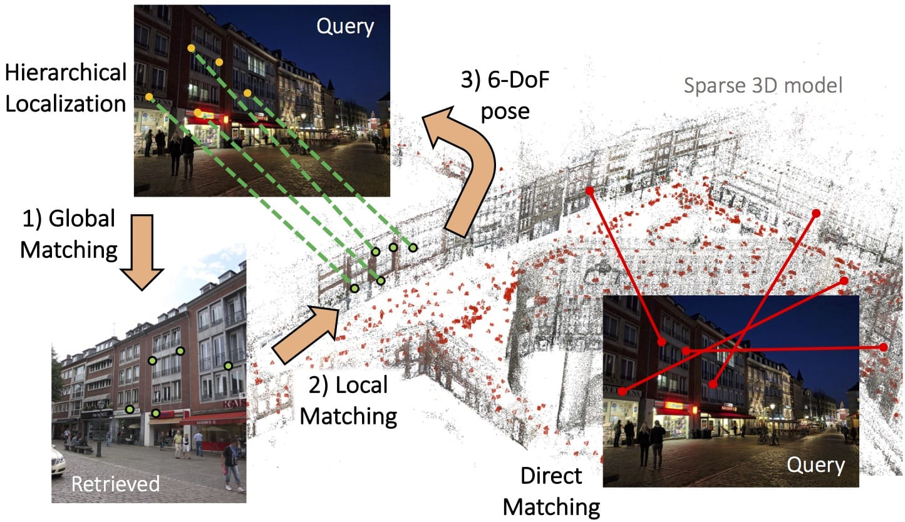
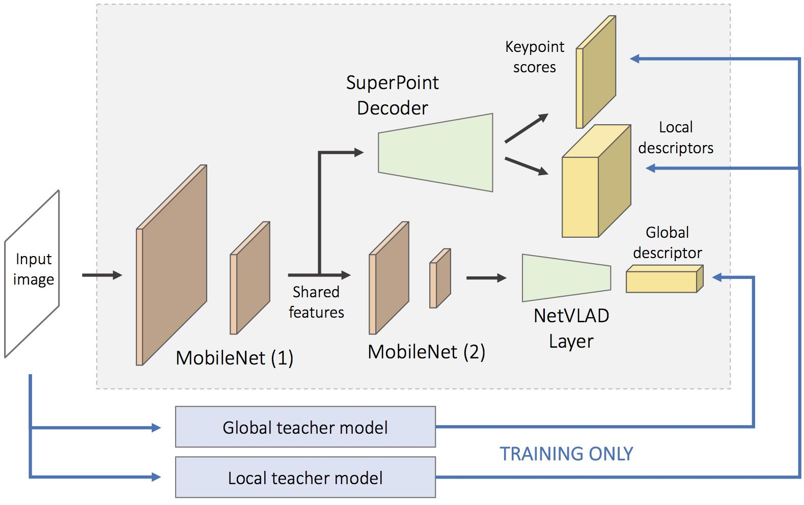

# HF-Net: Robust Hierarchical Localization at Large Scale

This repository accompanies our paper *[From Coarse to Fine: Robust Hierarchical Localization at Large Scale](https://arxiv.org/abs/1812.03506)*. We introduce a 6-DoF visual localization method that is accurate, scalable, and efficient, using HF-Net, a monolithic deep neural network for descriptor extraction. The proposed solution achieves state-of-the-art accuracy on several large-scale public benchmarks while running in real-time.

<p align="center">
  
  <br /><em>Our method is significantly more robust, accurate, and scalable than standard approaches based on direct matching.</em>
</p>

##

This code allows to:
- Perform state-of-the-art 6-DoF hierarchical localization using a flexible Python pipeline
- Train HF-Net with multi-task distillation in TensorFlow
- Evaluate feature detectors and descriptors on standard benchmarks
- Build Structure-from-Motion models based on state-of-the-art learned features

## Setup

Python 3.6 is required. It is advised to run the following  command within a virtual environment. By default, TensorFlow 1.6 GPU will be installed. You will be prompted to provide the path to a data folder (subsequently referred as `$DATA_PATH`) containing the datasets and pre-trained models and to an experiment folder (`$EXPER_PATH`) containing the trained models, training and evaluation logs, and CNN predictions. Create them wherever you wish and make sure to provide their absolute paths.
```bash
make install  # install Python requirements, setup paths
```

Refer to our [dataset documentation](doc/datasets.md) for an overview of the supported datasets and their expected directory structure.

## Demo

We provide a __minimal example of the inference and localization with HF-Net__ in [`demo.ipynb`](demo.ipynb). Download the trained model [here](TODO) and unpack it in `$EXPER_PATH/saved_models/`.

<p align="center">
  
  <br /><em>HF-Net simultaneously predicts global descriptors and local features with an efficient architecture.</em>
</p>

## 6-DoF Localization

We provide code to perform and evaluate our hierarchical localization on the three challenging benchmark datasets of [Sattler et al](https://arxiv.org/abs/1707.09092): Aachen Day-Night, RobotCar Seasons, and CMU Seasons.

#### Required assets

Download the datasets as indicated in the [dataset documentation](doc/datasets.md). We provide SfM models of [Aachen](TODO), [RobotCar](TODO) and [CMU](TODO) built with HF-Net/SuperPoint. Download and unpack the HF-Net weights in `$EXPER_PATH/hfnet/`. To localize with NV+SP, download the network weights of [NetVLAD](http://rpg.ifi.uzh.ch/datasets/netvlad/vd16_pitts30k_conv5_3_vlad_preL2_intra_white.zip) and [SuperPoint](https://github.com/MagicLeapResearch/SuperPointPretrainedNetwork/blob/master/superpoint_v1.pth) and put them in `$DATA_PATH/weights/`.

#### Exporting the predictions

We first export the predictions for all database and query images as `.npz` files, and subsequently run the localization.
```bash
python3 hfnet/export_predictions.py \
	hfnet/configs/[hfnet|superpoint|netvlad]_export_[aachen|cmu|robotcar].yaml \
	[hfnet|superpoint|netvlad]/predictions_[aachen|cmu|robotcar] \
	--keys keypoints,scores,local_descriptor_map,global_descriptor  # adjust depending on model
```

#### Localization

For Aachen:
```bash
python3 hfnet/evaluate_aachen.py \
	<sfm_model_name_or_path> \
	<eval_name> \
	--local_method [hfnet|superpoint|sift] \
	--global_method [hfnet|netvlad] \
	--build_db \
	--queries [night_time|day_time] \
	--export_poses
```

For RobotCar:
```bash
python3 hfnet/evaluate_robotcar.py \
	<sfm_model_name_or_path> \
	<eval_name> \
	--local_method [hfnet|superpoint|sift] \
	--global_method [hfnet|netvlad] \
	--build_db \
	--queries [dusk|sun|night|night-rain] \
	--export_poses
```

For CMU:
```bash
python3 hfnet/evaluate_cmu.py \
	<sfm_model_name_or_path> \
	<eval_name> \
	--local_method [hfnet|superpoint|sift] \
	--global_method [hfnet|netvlad] \
	--build_db \
	--slice [2|3|4|5|6|7|8|9|10|17] \
	--export_poses
```

The localization parameters can be adjusted in `hfnet/evaluate[aachen|robotcar|cmu].py`. The evaluation logs and estimated poses are written to `$EXPER_PATH/eval/[aachen|robotcar|cmu]/<eval_name>*`. Of particular interest are the PnP+RANSAC success rate, the average number of inliers per query, and the average inlier ratio.

#### Visualization

Successful and failed queries can be visualized in `notebooks/visualize_localization_[aachen|robotcar|cmu].ipynb`.

## Training with multi-task distillation

Instructions to train HF-Net are provided in the [training documentation](doc/training.md).

## Evaluation of local features

Instructions to evaluate feature detectors and descriptors on the HPatches and SfM datasets are provided in the [local evaluation documentation](doc/local_evaluation.md).

## Building new SfM models

Instructions and scripts to build SfM models using [COLMAP](https://colmap.github.io/) for any learned features are provided in `colmap-helpers`.

## Citation

Please consider citing the corresponding publication if you use this work in an academic context:
```
@article{hfnet2018,
  title={From Coarse to Fine: Robust Hierarchical Localization at Large Scale},
  author={Sarlin, P.-E. and Cadena, C. and Siegwart, R. and Dymczyk, M.},
  journal={arXiv:1812.03506},
  year={2018}
}
```
